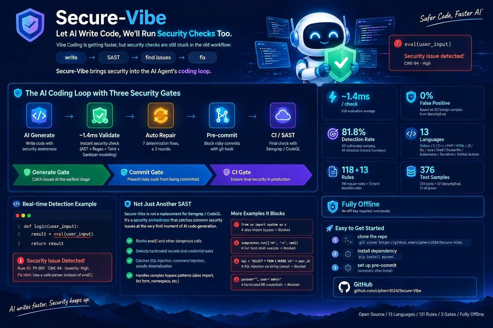

# Secure-Vibe — Fast security lint + engine orchestrator + commit gate

<div align="center">
  
</div>

[](LICENSE)


[](https://github.com/cipherc1024/Secure-Vibe/releases)
[](https://github.com/cipherc1024/Secure-Vibe/actions/workflows/ci.yml)

A millisecond-scale security linter for AI-generated code, an orchestrator that delegates to
real engines (built-in rules + semgrep + dependency scanners), and a commit gate
(pre-commit hook + CI job) so insecure code is mechanically blocked, not just discouraged.

- **Fast lint**: ~0.2 ms per check, zero API keys, fully offline — runs inside an agent's inner loop.
- **Engine orchestrator**: built-in 97-rule engine + semgrep (auto-installed in CI, graceful
  degrade locally) + pip-audit / govulncheck / npm audit, normalized into one finding shape.
- **Commit gate**: `cli.py precommit` hooks into git; `cli.py sast` runs as a CI job. Findings
  block the merge; skipping the hook locally does not skip CI.
- **Not** a full SAST: no interprocedural analysis, no runtime protection, no ops story. The
  built-in engine is deliberately shallow and complements (not replaces) deep scanners.

## Quick start (5 minutes, no agent needed)

```bash
pip install pyyaml            # the only dependency
git clone git@github.com:cipherc1024/Secure-Vibe.git && cd Secure-Vibe

python cli.py selftest                                  # verify the install: {"ok": true, ...}
python cli.py context --task "write a login endpoint" --language python   # the rules the generator will see
python cli.py validate --code 'x = eval(user_input)' --language python    # exit 1, violations below

# commit gate: hook into git + scan a whole directory
python cli.py precommit --install-hook                  # staged files are validated before every commit
python cli.py sast .                                    # builtin + semgrep + dependency scanners
```

`validate` output for that snippet (exit code 1):

```json
{
  "ok": true, "passed": false, "language": "python",
  "violations": [
    {
      "rule_id": "PY-001", "line": 1, "severity": "high", "checker": "ast",
      "snippet": "x = eval(user_input)",
      "fix_hint": "Never feed untrusted input to eval/exec. JSON -> json.loads; ...",
      "cwe": "CWE-95"
    }
  ],
  "repair_instruction": "1 violation(s) found. Fix them one by one per fix_hint, ..."
}
```

Fix the snippet per `fix_hint`, re-validate, and when it passes:

```bash
python cli.py log --task "login endpoint" --file fixed.py --retries 1 --verdict passed
```

For the full agent loop (context → generate → validate → repair ≤3× → log), install the skill (next section) or run `python main.py --demo` for a 10-second mock end-to-end.

## Usage modes

### Cross-agent installation (opencode / Codex / Claude Code)

This skill uses the SKILL.md format shared by mainstream agents (frontmatter: `name` + `description`).
The validator `cli.py` resolves rules/templates relative to itself and **does not depend on the working
directory** — any agent that can run a shell can invoke it:

| Agent | Default skill directory | Install command |
|-------|-------------------------|-----------------|
| opencode | `~/.config/opencode/skill/secure-vibe` | `./install.sh` or `powershell -File install.ps1` |
| Codex | `~/.codex/skills/secure-vibe` | `./install.sh codex` or `powershell -File install.ps1 -Agent codex` |
| Claude Code | `~/.claude/skills/secure-vibe` | `./install.sh claude` or `powershell -File install.ps1 -Agent claude` |
| Other/custom | anywhere | `./install.sh /path/to/skills/secure-vibe` or `-Target "C:\..."` |

- Runtime requirement: any Python 3.8+ (use `python3` on Linux/macOS) + `pyyaml` (`pip install pyyaml`, see `requirements.txt`). The install script auto-detects an interpreter with pip, records the chosen interpreter into `config.yaml` (`interpreter:` — `cli.py` warns at startup when running under a different one), and runs `selftest`; on missing deps it prints machine-specific fix commands instead of a bare traceback.
- `context` / `validate` / `sast` / `precommit` / `log` / `selftest` run locally at millisecond scale — **zero network, zero API key**.
- **After installing, restart the agent session and verify by asking the agent to list its available skills** (the skill name is `secure-vibe`).

### Mode A: install into an agent (recommended, the skill's primary form)

Install this skill into an agent (opencode / Codex / Claude Code / any framework with skill directories).
Generation is performed by the agent's own LLM (session mode); this skill supplies four deterministic tools
— context building / millisecond validation / repair instructions / logging — **zero API dependency, zero secrets**.

```bash
# Windows (default: opencode skill directory)
powershell -File install.ps1
# Codex / Claude Code
powershell -File install.ps1 -Agent codex
powershell -File install.ps1 -Agent claude

# Linux / macOS
./install.sh                 # default: opencode
./install.sh codex           # Codex
./install.sh claude          # Claude Code
```

The install script copies the skill files and runs a self-test (`cli.py selftest`). After restarting the agent, it runs before writing code:

```
step 1   cli.py context --task "..."      # load the security rules (before writing code)
step 2   (the agent's own LLM generates the code)
step 3   cli.py validate --file f.py      # millisecond validation (exit 1 = violations + fix_hint)
step 4   fix per fix_hint, retry <= 3 rounds; on repeated failure mark [needs human review]
step 5   cli.py log --task "..." --file f.py --verdict passed   # record
```

## Versioning and automatic updates (how installed users get new versions)

Three update paths, pick by release style:

### Path 1: git-managed install (recommended, one-click updates)

```bash
# install with -Repo / the second argument; the target directory is managed by git
powershell -File install.ps1 -Target ~/.config/opencode/skill/secure-vibe -Repo https://github.com/cipherc1024/Secure-Vibe.git
./install.sh ~/.config/opencode/skill/secure-vibe https://github.com/cipherc1024/Secure-Vibe.git

# after you publish a new version, users update with one click (equivalent to git pull --ff-only + self-test)
python ~/.config/opencode/skill/secure-vibe/cli.py update

# show the current version / compare against the remote latest version
python cli.py version --check https://github.com/cipherc1024/Secure-Vibe
```

## Use as a Python library (Mode B)

```python
from main import generate_secure_code, validate_code

# guide at generation time; validation failures trigger the automatic repair loop
outcome = generate_secure_code(
    task_description="implement the user login endpoint",
    language="python", framework="Flask",
)
print(outcome.code, outcome.passed, outcome.report)

# validate existing code only
result = validate_code("x = eval(user_input)", language="python")
print(result.summary())
```

or via the HTTP API:

```bash
pip install fastapi uvicorn
python server.py            # http://127.0.0.1:8399/docs
```

## Architecture

```
User Task ──> ① Context Builder ──> ② Generation (Agent LLM) ──> ③ Validator ──> ④ Automatic Repair Loop ──> ⑤ JSONL Log
                 ▲                                                                       │
                 └──────────────────────── missed-pattern report (feed the loop) <─────┘
```

- ① context_builder — injects the security rule list (general rules + blacklists + few-shot templates) into generation
- ② the agent's own LLM (session) / OpenAI / Claude / Ollama / Mock
- ③ validator — three engines, millisecond-scale: AST dangerous calls + regex blacklists + taint analysis
- ④ repair loop — deterministic AST-level fixes first (no LLM), then local/full LLM rewrites; up to 3 rounds
- ⑤ logger — JSONL with secret masking; `cli.py missed` reports missed detections to drive rule iteration

## Detection coverage (13 languages, 142 rules)

General rules shared across all languages: hardcoded secrets, SQL concatenation, plaintext HTTP,
weak randomness/hashes, JWT without signature verification, disabled TLS verification, sensitive logs.

| Language | Type | Count |
|----------|------|-------|
| Python | language | 43 rules (eval/os.system/pickle + SSRF/XXE/SSTI/path traversal/Zip Slip/NoSQL/ORM/JWT/CORS/open redirect/ReDoS/ML deserialization/weak crypto/JWT verify/traceback leak) |
| C | language | 7 rules |
| C++ | language | 2 rules (inherits all C rules) |
| PHP | language | 7 rules (inherits HTML+JS rules) |
| HTML | language | 5 rules (inherits JS rules) |
| JavaScript / Node | language | 17 rules (+ tree-sitter xast for eval/string-timer/dynamic require) |
| Go | language | 7 rules |
| Java / Spring | language | 10 rules |
| Shell | language | 5 rules |
| Dockerfile | IaC | 5 rules |
| Kubernetes | IaC | 5 rules |
| Terraform | IaC | 5 rules |
| GitHub Actions | CI | 3 rules |
| blacklists | all | 13 hard-banned patterns |
| CWE reference | knowledge | 21 entries |

Language aliases: `C++`→`cpp`, `javascript`/`node`/`nodejs`→`js`, `golang`→`go`, `bash`→`sh`, `docker`→`dockerfile`, `k8s`→`kubernetes`, `tf`→`terraform`, `workflow`/`gha`→`github-actions`.

## Project structure

```
Secure-Vibe/
├── SKILL.md                    # the agent skill entry (frontmatter: name + description)
├── cli.py                      # the agent's unified shell entry (subcommands: context/validate/log/missed/cwe/version/update/selftest)
├── main.py                     # Python library entry (generate_secure_code / validate_code)
├── server.py                   # optional FastAPI service
├── install.ps1 / install.sh    # cross-agent installers (opencode/Codex/Claude Code)
├── VERSION                     # skill version
├── LICENSE                     # MIT
├── SECURITY.md                 # security policy & missed-detection reporting
├── core/
│   ├── context_builder.py  # step 1: builds the security context (persona + general rules + language rules + blacklists + few-shot + checklist)
│   ├── validator.py        # step 3: three-engine validator (AST dangerous calls + regex blacklist + taint confirmations)
│   ├── taint.py            # step 3a: lightweight taint analysis (source -> propagation -> dangerous-sink confirmation)
│   ├── ast_fixer.py        # step 4a: AST deterministic fix engine (zero LLM, safe equivalent rewrites)
│   ├── repair_loop.py      # step 4b: hybrid repair loop
│   ├── llm_backend.py      # pluggable LLM backends (session/openai/claude/ollama/mock)
│   └── logger.py           # step 5: JSONL logger with secret masking
├── rules/
│   ├── general.yaml           # general rules (8: secrets/SQL concat/weak randomness/weak hashes/TLS/JWT..., shared by every language)
│   ├── python.yaml            # Python rules (22: eval/os.system/pickle + SSRF/XXE/SSTI/path/ZipSlip/NoSQL/ORM/JWT/CORS/redirect/ReDoS/ML deserialization)
│   ├── c.yaml                 # C rules (7: system/sprintf/strcpy/format strings/scanf/tmpnam...)
│   ├── cpp.yaml               # C++ rules (2: std:: unsafe functions/concat commands; inherits C rules)
│   ├── php.yaml               # PHP rules (7: shell_exec/eval/SQL concat superglobals/unserialize/include vars/unescaped echo/extract)
│   ├── html.yaml              # HTML rules (5: inline handlers/javascript: URLs/iframe sandbox/SRI/noopener)
│   ├── js.yaml                # JS rules (9: eval/innerHTML DOM XSS/document.write/string timers/postMessage + Node exec/res.send/prototype pollution/dynamic require)
│   ├── go.yaml                # Go rules (7: shell-wrapped commands/SQL concat/SSRF/template.HTML/rand/form-to-sink/TLS)
│   ├── java.yaml              # Java rules (7: exec concat/JDBC concat/deserialization/XXE/Random/Actuator/ECB)
│   ├── sh.yaml                # Shell rules (5: curl|sh/eval/rm -rf/unquoted vars/NOPASSWD)
│   ├── dockerfile.yaml        # Dockerfile rules (5: USER root/secrets in image/curl|sh/remote ADD/latest)
│   ├── kubernetes.yaml        # K8s rules (5: privileged/hostPath/hostNetwork/root/Secret env)
│   ├── terraform.yaml         # Terraform rules (5: 0.0.0.0/0/public ACL/public RDS/hardcoded secrets/all ports)
│   ├── github-actions.yaml    # GitHub Actions rules (3: expression injection/secrets in logs/unpinned actions)
│   └── cwe_reference.yaml     # CWE reference knowledge (21 entries; extendable via tools/mine_cwe_rules.py)
├── blacklist/python.yaml      # Python hard-bans (7)
├── blacklist/c.yaml           # C/C++ hard-bans (2: gets/system-with-variable-command)
├── blacklist/php.yaml         # PHP hard-bans (2: superglobals into exec/include)
├── blacklist/js.yaml          # JS/Node hard-bans (2: URL source into innerHTML, prototype-pollution merge)
├── templates/python/          # Python safe templates (7)
│   ├── db_query.py            #    parameterized SQL
│   ├── password_hash.py       #    PBKDF2 password hashing
│   ├── secure_token.py        #    secrets-safe token
│   ├── auth.py                #    secure login endpoint
│   └── file_upload.py         #    secure file upload
├── templates/c/               # C safe templates (snprintf/fgets/execv)
├── templates/cpp/             # C++ safe templates (std::string/getline)
├── templates/php/             # PHP safe templates (prepared PDO + htmlspecialchars)
├── templates/html/            # HTML safe templates (CSP/SRI/sandbox/noopener)
├── templates/js/              # JS safe templates (textContent/addEventListener/postMessage)
├── templates/go/              # Go safe templates (placeholder SQL/argv exec)
├── templates/sh/              # Shell safe templates (quoted variables/verify-before-run)
├── templates/java/            # Java safe templates (PreparedStatement/SecureRandom)
├── tools/
│   ├── mine_cwe_rules.py      # mine CWE->fix mappings from GHSA-CySec; --from-logs mines missed patterns
│   ├── run_evaluation.py      # pro-level evaluation (--local offline baseline / SecurityEval)
│   ├── benchmark.py           # local benchmark (detection rate / FPR / latency)
│   ├── agent_e2e_check.py     # offline end-to-end check of the agent toolchain
│   ├── server_smoke.py        # HTTP service smoke test
│   └── llm_e2e.py             # real-LLM end-to-end (--backend mock for offline self-test)
├── tests/                     # 225 cases (detection + zero-false-positive + loop/taint/log/AST fix + C/C++ + web + Go/Shell + IaC + Java/Node + CI)
├── docs/
│   ├── log_format.md          # log format spec
│   └── evaluation.md          # pro-level evaluation guide
└── logs/                      # JSONL output (gitignored)
```

## How to add rules (no code changes needed)

Append one list item to `rules/python.yaml` (or `general.yaml`, `c.yaml`, `cpp.yaml`, `php.yaml`, `html.yaml`, `js.yaml`, `go.yaml`, `java.yaml`, `sh.yaml`, `dockerfile.yaml`, `kubernetes.yaml`, `terraform.yaml`, `github-actions.yaml`):

```yaml
- id: PY-022                        # unique id
  name: my_new_rule
  severity: high                    # high / medium / low
  cwe: CWE-XXX                      # optional
  message: human-readable description
  fix_hint: repair advice (fed back to the LLM)
  template: db_query                # optional, deterministic-replacement template for high-risk items
  match:                            # matching methods (combinable)
    ast_calls: [eval, exec]         #   dangerous function calls (dot paths)
    ast_kwargs:                     #   keyword-argument constraints
      subprocess.run: {shell: literal-true}
    regex:                          #   regex pattern list (block scalars recommended)
      - "(?<!w)system("
    exclude_regex: ["SafeLoader"]   #   exclusion patterns
```

`ignore_rules` in `config.yaml → validator.ignore_rules` allowslist exception (globally),
with a justification comment.

## How to add templates (few-shot)

Write `templates/<language>/<name>.<ext>` containing **provably safe** code. `context_builder` pulls templates in
on-demand by matching task keywords (few-shot keeps token usage low), and the violation's `template` field points
high-risk items at a specific template for the deterministic fix. Examples live in `templates/python/` plus the
`c/cpp/php/html/js/go/sh/java` directories.

## How to add languages / extend the model

```python
from main import generate_secure_code, validate_code
from core.validator import Validator

# validate only (no generation, no repair)
result = validate_code('import os\nos.system("ls")', language="python")
print(result.passed, result.summary())

# custom validators per language
v = Validator(language="cpp")   # inherits C rules automatically
print(v.validate('std::strcpy(dst, src);').summary())
```

## Trust & guarantees

- **Deterministic fixes are mechanically constrained**: the seven AST rewrites (random→secrets,
  md5/sha1→sha256, yaml.load→safe_load, plaintext constant→os.environ.get, shell=True string
  command→argument list, `%s`-concat SQL→parameterized query, path concat→os.path.join+basename)
  never go through an LLM and are re-validated after applying. Optionally, post-repair regression
  verification runs the project's own tests; a fix that breaks behavior is reverted.
- **Everything is auditable**: the full system prompt is built by `cli.py context` and logged; every
  repair round is recorded in JSONL with the violation list, the code, the action taken, and the
  verdict. When the repair loop does not converge, a full human-review ticket is written
  (context, per-violation analysis, alternatives) instead of a bare failure flag.
- **Secrets are masked in logs** on a best-effort basis (`logging.mask_secrets`).
- Honest boundary: this is a **fast linter + orchestrator + commit gate, not a security proof**.
  It cannot reason across modules or function boundaries, and taint sanitizers are modeled only as
  a fixed allowlist (html.escape, shlex.quote, parameterized coercion...), not proven; enforcement
  is mechanical (the hook and the CI job), but the checks themselves are shallow; deep guarantees
  come from the integrated engines (semgrep, dependency scanners), not from this tool alone.

## Detection coverage notes

| Stage | Mechanism |
|-------|-----------|
| ① **Context injection** | rule list + banned patterns + few-shot safe templates injected into the generation prompt |
| ② **validation** | three engines, millisecond-scale (AST dangerous calls + regex blacklists + taint confirmations) |
| ③ **automatic repair** | deterministic AST rewrites (random->secrets, md5->sha256, yaml.load->safe_load, hardcoded secrets->env) + LLM local rewrite; 3 rounds max |
| ④ **logging & iteration** | JSONL audit trail with secret masking; `cli.py missed` reports bypasses so rules improve |

## Tests

```bash
python -m pytest tests/ -q          # unit + integration (255: validation/repair/taint/log/AST-fix + all languages)
python cli.py selftest              # post-install self-test + 56-sample positive/negative suite
python tools/agent_e2e_check.py     # offline agent-toolchain E2E
python tools/benchmark.py           # local benchmark (detection 1.0 / FPR 0.0 / ~0.2ms)
```

Numbers above come from the built-in sample suite (自测小样本, small self-test). On the
authoritative [SecurityEval](https://github.com/s2e-lab/SecurityEval) benchmark (full official
`dataset.jsonl`: 121 CWE-annotated insecure samples + 121 benign prompts), the built-in engine measures:
**detection 81.8% / false positives 0.0% / ~1.4 ms** (baseline 38.8% before the taint-engine expansion;
remaining gaps are semantic CWEs — missing-auth/access-control logic and cross-function input
flow — outside a line-level linter's scope); residual dataflow-depth findings are delegated to
the `sast` orchestrator (semgrep/CodeQL). See
`docs/evaluation.md` for the breakdown and `missed_by_cwe` gaps.

## Engine positioning (built-in vs integrated)

| | Built-in engine | semgrep (integrated) | pip-audit / govulncheck / npm audit |
|---|---|---|---|
| Role | fast lint in the agent's inner loop | deep rule coverage | known-vulnerable dependencies |
| Latency | ~0.2 ms/check | seconds | seconds |
| Depth | line-level + Python taint + js xast, 142 rules | thousands of community rules | OSV databases |
| Availability | zero deps beyond pyyaml | auto-installed in CI; graceful degrade locally with an install hint | detected per ecosystem, skipped honestly when absent |

The built-in engine is intentionally shallow and never claims to replace the others —
`cli.py sast` runs all of them and reports which engines ran, which were skipped, and why.

## Troubleshooting

- **`python` not found on Linux/macOS** — use `python3`; the install script already probes `python3`/`python`/`py`.
- **`cli.py` outputs mojibake in a Windows console** — `cli.py` forces UTF-8 on stdout; view via `> out.json` and open with UTF-8, or run inside the agent (which reads UTF-8 correctly).
- **Windows Defender quarantines test/payload files** — when experimenting with malicious samples, store them under an excluded folder, or build payload strings at runtime (the repo tests do exactly this).
- **GitHub unreachable (some networks)** — the git remote works over SSH (`git@github.com`); HTTPS is often what is blocked. `git push` via SSH is unaffected.
- **An agent refuses to call the CLI** — prompt the agent with the one-line workflow from `SKILL.md`; ask it to run `cli.py selftest` first as proof it can.

## Contributing

1. **Add a rule** — one YAML item (see above), no code changes; a test case in `tests/` keeps the CI green.
2. **Report a missed detection** — run `python cli.py missed --pattern "<snippet>" --note "<why it's dangerous>"`; after review it is promoted into `rules/`.
3. **Code changes** — open a PR; CI runs `pytest` on Python 3.10/3.11/3.12. Tests are mandatory (225 and counting).
4. Security issues: see [SECURITY.md](SECURITY.md).

## Roadmap

- Rust / Ruby / Swift rule sets
- Multi-file & inter-module taint (moving past one code block)
- Node/Java AST engines (js: tree-sitter precise call matching; java: cross-statement taint-lite — both need optional tree-sitter; C/Go/Shell run on regex)
- Sanitizer modeling to cut known false positives

## Known limits

- The regex engine is **line-level**; cross-line data flow is covered by the taint engines (Python full; js/java cross-statement via optional tree-sitter) or blacklist patterns.
- Sanitizers are modeled as fixed allowlists (Python + js escape/encode helpers), not proven safe.
- **No interprocedural analysis, no runtime protection, no deployment/ops checks** — a passing
  gate means "no known violation of the built-in rules", nothing more.
- Other languages (Rust/Ruby/Swift) fall back to general rules only.

## License

MIT — see [LICENSE](LICENSE).
